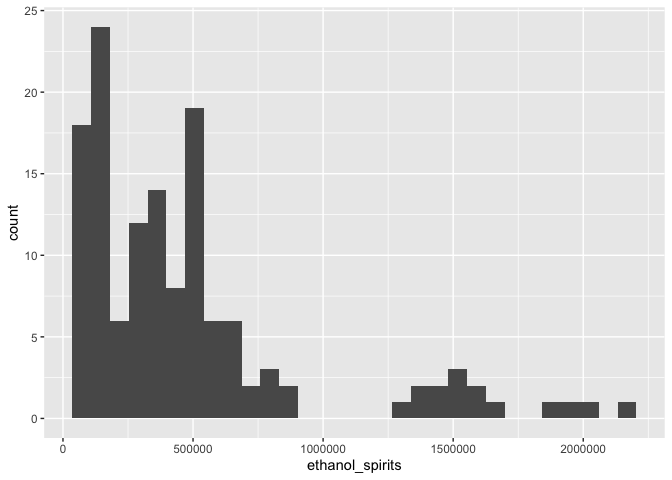
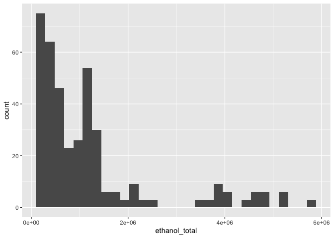
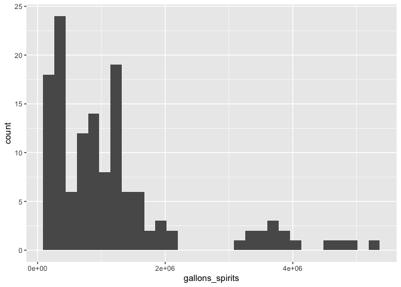
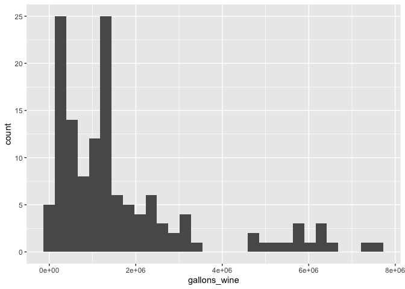
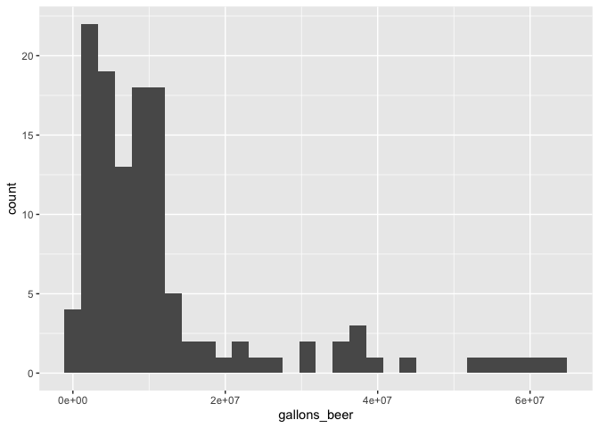
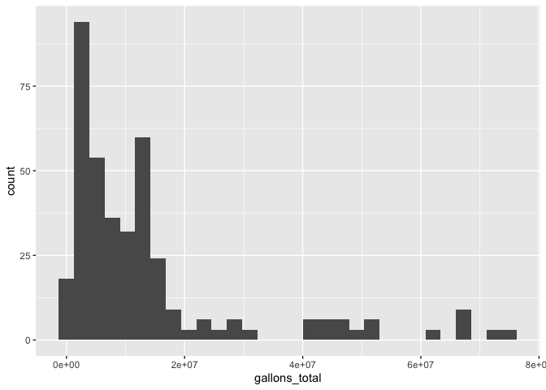
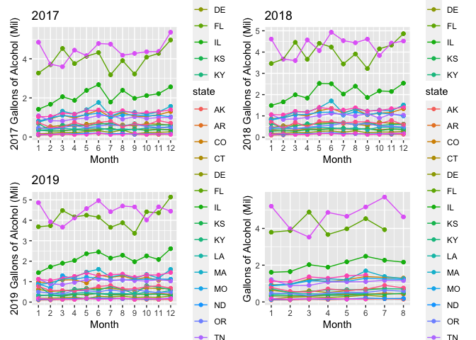

Thesis\_Alcohol
================

``` r
library(tidyverse)
```

    ## ── Attaching packages ─────────────────────────────────────── tidyverse 1.3.0 ──

    ## ✓ ggplot2 3.3.2     ✓ purrr   0.3.4
    ## ✓ tibble  3.0.4     ✓ dplyr   1.0.2
    ## ✓ tidyr   1.1.2     ✓ stringr 1.4.0
    ## ✓ readr   1.3.1     ✓ forcats 0.5.0

    ## ── Conflicts ────────────────────────────────────────── tidyverse_conflicts() ──
    ## x dplyr::filter() masks stats::filter()
    ## x dplyr::lag()    masks stats::lag()

``` r
library(readxl)
library(ggplot2)
library(patchwork)
library(plotly) 
```

    ## 
    ## Attaching package: 'plotly'

    ## The following object is masked from 'package:ggplot2':
    ## 
    ##     last_plot

    ## The following object is masked from 'package:stats':
    ## 
    ##     filter

    ## The following object is masked from 'package:graphics':
    ## 
    ##     layout

``` r
library(geepack)
library(lme4)
```

    ## Loading required package: Matrix

    ## 
    ## Attaching package: 'Matrix'

    ## The following objects are masked from 'package:tidyr':
    ## 
    ##     expand, pack, unpack

``` r
## Import Alcohol Dataset: Filter to 2020 
apis_df=
  read_excel("./data/alcsales_August2020.xlsx",
             sheet = 3, 
             guess_max = 10000) %>% 
  janitor::clean_names() %>% 
  filter(year == "2020") %>% 
  mutate(beverage = 
           recode(beverage,
                  `1` = "spirits", 
                  `2` = "wine", 
                  `3` = "beer")) %>%
  group_by(fips, month) %>% 
    mutate(
      ethanol_total = sum(ethanol),
      gallons_total = sum(gallons)) %>%  
  pivot_wider(
    names_from = beverage, 
    values_from = c(gallons, ethanol)
    ) %>% 
  view()
```

``` r
## 2020 Spirits  

spirits=
  apis_df %>%
  select(
    -gallons_beer, -gallons_wine, 
    -ethanol_beer, -ethanol_wine,
    -per_capita3yr) %>% 
  drop_na() %>% 
  arrange(fips) %>% 
  relocate(fips, month) %>% 
  select(-year) %>% 
  view()

## 2020 Wine  

wine=
  apis_df %>%
  select(
    -gallons_beer, -gallons_spirits, 
    -ethanol_beer, -ethanol_spirits,
    -per_capita3yr) %>% 
  drop_na() %>% 
  arrange(fips) %>%
  relocate(fips, month) %>% 
  select(-year) %>% 
  view()

## 2020 Beer  

beer=
  apis_df %>%
  select(
    -gallons_spirits, -gallons_wine, 
    -ethanol_spirits, -ethanol_wine,
    -per_capita3yr) %>% 
  drop_na() %>% 
  arrange(fips) %>% 
  relocate(fips, month) %>% 
  select(-year) %>% 
  view()

## 2020 Total Gallons and Alcohol 

total_alcohol=
  apis_df %>%
  select(
    year, fips, month, population,
    ethanol_total, gallons_total) %>% 
  view()
```

``` r
#### On-Premises Establishments - Restaurants Since January 1, 2020

#Original
onprem_rest=
  read_excel("./data/state_alcohol_policies.xlsx", 
             sheet = 2,
             range = cell_cols("A:J"),
             col_names = TRUE,
             col_types = c("text", "numeric", "date", 
                           "text", "text", "text", "text", "text",
                           "text", "text")) %>% 
  janitor::clean_names() %>%
  rename(fips = fips_code)

#Recoded
onprem_rest1=
  read_excel("./data/state_alcohol_policies.xlsx", 
             sheet = 2,
             range = "N1:X191",
             col_names = TRUE,
             guess_max = 10000) %>% 
  janitor::clean_names() %>%
  rename(fips = fips_code) %>% 
  transform(
    month = as.numeric(month)
    ) %>% 
  relocate(fips, month) %>% 
  view()


#### On-Premises Establishments - Bars Since January 1, 2020

#Original
onprem_bar=
  read_excel("./data/state_alcohol_policies.xlsx", 
             sheet = 3,
             range = cell_cols("A:J"),
             col_names = TRUE,
             col_types = c("text", "numeric", "date", 
                           "text", "text", "text", "text", "text",
                           "text", "text")) %>% 
  janitor::clean_names() %>%
  rename(fips = fips_code)  

#Recoded
onprem_bar1=
  read_excel("./data/state_alcohol_policies.xlsx", 
             sheet = 3,
             range = "N1:X191",
             col_names = TRUE) %>% 
  janitor::clean_names() %>%
  rename(fips = fips_code) %>% 
  transform(
    month = as.numeric(month)
    ) %>% 
  relocate(fips, month) %>% 
  view()


#### Off-Premises Establishments - Since January 1, 2020

#Recoded
off_premise=
  read_excel("./data/state_alcohol_policies.xlsx", 
             sheet = 4,
             range = "H1:L191",
             col_names = TRUE) %>% 
  janitor::clean_names() %>% 
  rename(fips = fips_code) %>% 
  transform(
    month = as.numeric(month)
    ) %>% 
  relocate(fips, month) %>% 
  view()
```

``` r
#### Merging Datasets

## Spirits 
spirits_rest=
  merge(spirits, onprem_rest1,
      by = c("fips", "month")) %>% 
  relocate(state, fips, month, gallons_spirits, ethanol_spirits) 

spirits_bar=
  merge(spirits, onprem_bar1,
      by = c("fips", "month")) %>% 
  relocate(state, fips, month, gallons_spirits, ethanol_spirits)

spirits_offprem=
  merge(spirits, off_premise,
      by = c("fips", "month")) %>% 
  relocate(state, fips, month, gallons_spirits, ethanol_spirits) 


## Wine 
wine_rest=
  merge(wine, onprem_rest1,
      by = c("fips", "month")) %>% 
  relocate(state, fips, month, gallons_wine, ethanol_wine) 

wine_bar=
  merge(wine, onprem_bar1,
      by = c("fips", "month")) %>% 
  relocate(state, fips, month, gallons_wine, ethanol_wine)

wine_offprem=
  merge(wine, off_premise,
      by = c("fips", "month")) %>% 
  relocate(state, fips, month, gallons_wine, ethanol_wine) 


## Beer 
beer_rest=
  merge(beer, onprem_rest1,
      by = c("fips", "month")) %>% 
  relocate(state, fips, month, gallons_beer, ethanol_beer) 

beer_bar=
  merge(beer, onprem_bar1,
      by = c("fips", "month")) %>% 
  relocate(state, fips, month, gallons_beer, ethanol_beer)

beer_offprem=
  merge(beer, off_premise,
      by = c("fips", "month")) %>% 
  relocate(state, fips, month, gallons_beer, ethanol_beer) 

## Total Alochol Content  

alcohol_rest=
  merge(total_alcohol, onprem_rest1,
      by = c("fips", "month")) %>% 
  relocate(state, fips, month, ethanol_total, gallons_total) %>% 
  view()

alcohol_bar=
  merge(total_alcohol, onprem_bar1,
     by = c("fips", "month")) %>% 
  relocate(state, fips, month, ethanol_total, gallons_total)  
 

alcohol_offprem=
  merge(total_alcohol, off_premise,
      by = c("fips", "month")) %>% 
  relocate(state, fips, month, ethanol_total, gallons_total)  
```

``` r
#### 2020 Restaurant Spirits Plots

#Beverage 
bev_spirits=
  spirits_rest %>% 
  ggplot(aes(x = month, y = gallons_spirits/1000000, color = state)) + 
  geom_point() +
  geom_line() + 
  labs(x = "Month", 
       y = "Gallons of Beverage") +
  scale_x_continuous(
    breaks = c(1, 2, 3, 4, 5, 6, 7, 8)) 

#Alcohol 
etoh_spirits=
  spirits_rest %>% 
  ggplot(aes(x = month, y = ethanol_spirits/1000000, color = state)) + 
  geom_point() +
  geom_line() + 
  labs(x = "Month", 
       y = "Ethanol") +
  scale_x_continuous(
    breaks = c(1, 2, 3, 4, 5, 6, 7, 8)) 


#### 2020 Wine Plots

#Beverage 
bev_wine=
  wine_rest %>% 
  ggplot(aes(x = month, y = gallons_wine/1000000, color = state)) + 
  geom_point() +
  geom_line() + 
  labs(x = "Month", 
       y = "Gallons of Beverage") +
  scale_x_continuous(
    breaks = c(1, 2, 3, 4, 5, 6, 7, 8)) 

#Alcohol 
etoh_wine=
  wine_rest %>% 
  ggplot(aes(x = month, y = ethanol_wine/1000000, color = state)) + 
  geom_point() +
  geom_line() + 
  labs(x = "Month", 
       y = "Ethanol") +
  scale_x_continuous(
    breaks = c(1, 2, 3, 4, 5, 6, 7, 8)) 


#### 2020 Beer Plots

#Beverage 
bev_beer =
  beer_rest %>% 
  ggplot(aes(x = month, y = gallons_beer/1000000, color = state)) + 
  geom_point() +
  geom_line() + 
  labs(x = "Month", 
       y = "Gallons of Beverage") +
  scale_x_continuous(
    breaks = c(1, 2, 3, 4, 5, 6, 7, 8)) 

#Alcohol 
etoh_beer=
  beer_rest %>% 
  ggplot(aes(x = month, y = ethanol_beer/1000000, color = state)) + 
  geom_point() +
  geom_line() + 
  labs(x = "Month", 
       y = "Ethanol") +
  scale_x_continuous(
    breaks = c(1, 2, 3, 4, 5, 6, 7, 8)) 


#### Total Alcohol Plot

#Alcohol 
alcohol_2020 =
  alcohol_rest %>% 
  ggplot(aes(x = month, y = ethanol_total/1000000, color = state)) + 
  geom_point() +
  geom_line() + 
  labs(x = "Month", 
       y = "Gallons of Alcohol (Mil)") +
  scale_x_continuous(
    breaks = c(1, 2, 3, 4, 5, 6, 7, 8)) 
```

``` r
## Histogram of outcomes

#Alcohol
ggplot(spirits_rest, aes(x=ethanol_spirits)) + geom_histogram()
```

    ## `stat_bin()` using `bins = 30`. Pick better value with `binwidth`.

<!-- -->

``` r
ggplot(wine_rest, aes(x=ethanol_wine)) + geom_histogram()
```

    ## `stat_bin()` using `bins = 30`. Pick better value with `binwidth`.

<!-- -->

``` r
ggplot(beer_rest, aes(x=ethanol_beer)) + geom_histogram()
```

    ## `stat_bin()` using `bins = 30`. Pick better value with `binwidth`.

<!-- -->

``` r
ggplot(alcohol_rest, aes(x=ethanol_total)) + geom_histogram()
```

    ## `stat_bin()` using `bins = 30`. Pick better value with `binwidth`.

<!-- -->

``` r
#Beverages 
ggplot(spirits_rest, aes(x=gallons_spirits)) + geom_histogram()
```

    ## `stat_bin()` using `bins = 30`. Pick better value with `binwidth`.

<!-- -->

``` r
ggplot(wine_rest, aes(x=gallons_wine)) + geom_histogram()
```

    ## `stat_bin()` using `bins = 30`. Pick better value with `binwidth`.

<!-- -->

``` r
ggplot(beer_rest, aes(x=gallons_beer)) + geom_histogram()
```

    ## `stat_bin()` using `bins = 30`. Pick better value with `binwidth`.

<!-- -->

``` r
ggplot(alcohol_rest, aes(x=gallons_total)) + geom_histogram()
```

    ## `stat_bin()` using `bins = 30`. Pick better value with `binwidth`.

<!-- -->

``` r
### Bi-variate Models for outcome (total gallons of alcohol)  

# On-premise Restaurant Policy Models 
model1=
  glmer(ethanol_total ~ 1 + restaurant_open + (1|state),
        data = alcohol_rest, family="gaussian")
```

    ## Warning in glmer(ethanol_total ~ 1 + restaurant_open + (1 | state), data =
    ## alcohol_rest, : calling glmer() with family=gaussian (identity link) as a
    ## shortcut to lmer() is deprecated; please call lmer() directly

``` r
model2=
  glmer(ethanol_total ~ 1 + capacity_restrictions + (1|state), 
        data = alcohol_rest, family="gaussian")
```

    ## Warning in glmer(ethanol_total ~ 1 + capacity_restrictions + (1 | state), :
    ## calling glmer() with family=gaussian (identity link) as a shortcut to lmer() is
    ## deprecated; please call lmer() directly

``` r
model3=
  glmer(ethanol_total ~ 1 + food_restrictions + (1|state), 
        data = alcohol_rest, family="gaussian")
```

    ## Warning in glmer(ethanol_total ~ 1 + food_restrictions + (1 | state), data
    ## = alcohol_rest, : calling glmer() with family=gaussian (identity link) as a
    ## shortcut to lmer() is deprecated; please call lmer() directly

``` r
model4=
  glmer(ethanol_total ~ 1 + hours_restrictions + (1|state), 
        data = alcohol_rest, family="gaussian")
```

    ## Warning in glmer(ethanol_total ~ 1 + hours_restrictions + (1 | state), data
    ## = alcohol_rest, : calling glmer() with family=gaussian (identity link) as a
    ## shortcut to lmer() is deprecated; please call lmer() directly

``` r
model5=
  glmer(ethanol_total ~ 1 + outdoors_only_restrictions + (1|state), 
        data = alcohol_rest, family="gaussian")
```

    ## Warning in glmer(ethanol_total ~ 1 + outdoors_only_restrictions + (1 | state), :
    ## calling glmer() with family=gaussian (identity link) as a shortcut to lmer() is
    ## deprecated; please call lmer() directly

``` r
model6=
  glmer(ethanol_total ~ 1 + takeout_or_curbside + (1|state), 
        data = alcohol_rest, family="gaussian")
```

    ## Warning in glmer(ethanol_total ~ 1 + takeout_or_curbside + (1 | state), :
    ## calling glmer() with family=gaussian (identity link) as a shortcut to lmer() is
    ## deprecated; please call lmer() directly

``` r
model7=
  glmer(ethanol_total ~ 1 + deliver_to_homes + (1|state),
        data = alcohol_rest, family="gaussian")
```

    ## Warning in glmer(ethanol_total ~ 1 + deliver_to_homes + (1 | state), data
    ## = alcohol_rest, : calling glmer() with family=gaussian (identity link) as a
    ## shortcut to lmer() is deprecated; please call lmer() directly

``` r
# Bar Policy Models 

model8=
  glmer(ethanol_total ~ 1 + bar_open + (1|state),
        data = alcohol_bar, family="gaussian")
```

    ## Warning in glmer(ethanol_total ~ 1 + bar_open + (1 | state), data =
    ## alcohol_bar, : calling glmer() with family=gaussian (identity link) as a
    ## shortcut to lmer() is deprecated; please call lmer() directly

``` r
model9=
  glmer(ethanol_total ~ 1 + capacity_restrictions + (1|state), 
        data = alcohol_bar, family="gaussian")
```

    ## Warning in glmer(ethanol_total ~ 1 + capacity_restrictions + (1 | state), :
    ## calling glmer() with family=gaussian (identity link) as a shortcut to lmer() is
    ## deprecated; please call lmer() directly

``` r
model10=
  glmer(ethanol_total ~ 1 + food_restrictions + (1|state), 
        data = alcohol_bar, family="gaussian")
```

    ## Warning in glmer(ethanol_total ~ 1 + food_restrictions + (1 | state), data
    ## = alcohol_bar, : calling glmer() with family=gaussian (identity link) as a
    ## shortcut to lmer() is deprecated; please call lmer() directly

``` r
model10=
  glmer(ethanol_total ~ 1 + hours_restrictions + (1|state), 
        data = alcohol_bar, family="gaussian")
```

    ## Warning in glmer(ethanol_total ~ 1 + hours_restrictions + (1 | state), data
    ## = alcohol_bar, : calling glmer() with family=gaussian (identity link) as a
    ## shortcut to lmer() is deprecated; please call lmer() directly

``` r
model11=
  glmer(ethanol_total ~ 1 + outdoors_only_restrictions + (1|state), 
        data = alcohol_bar, family="gaussian")
```

    ## Warning in glmer(ethanol_total ~ 1 + outdoors_only_restrictions + (1 | state), :
    ## calling glmer() with family=gaussian (identity link) as a shortcut to lmer() is
    ## deprecated; please call lmer() directly

``` r
model12=
  glmer(ethanol_total ~ 1 + takeout_or_curbside + (1|state), 
        data = alcohol_bar, family="gaussian")
```

    ## Warning in glmer(ethanol_total ~ 1 + takeout_or_curbside + (1 | state), :
    ## calling glmer() with family=gaussian (identity link) as a shortcut to lmer() is
    ## deprecated; please call lmer() directly

``` r
model13=
  glmer(ethanol_total ~ 1 + deliver_to_homes + (1|state),
        data = alcohol_bar, family="gaussian")
```

    ## Warning in glmer(ethanol_total ~ 1 + deliver_to_homes + (1 | state), data
    ## = alcohol_bar, : calling glmer() with family=gaussian (identity link) as a
    ## shortcut to lmer() is deprecated; please call lmer() directly

``` r
# Off-premise Alcohol Policy Models 

model14=
  glmer(ethanol_total ~ 1 + open_restrictions + (1|state), 
        data = alcohol_offprem, family="gaussian")
```

    ## Warning in glmer(ethanol_total ~ 1 + open_restrictions + (1 | state), data =
    ## alcohol_offprem, : calling glmer() with family=gaussian (identity link) as a
    ## shortcut to lmer() is deprecated; please call lmer() directly

    ## fixed-effect model matrix is rank deficient so dropping 1 column / coefficient

``` r
model15=
  glmer(ethanol_total ~ 1 + deliver_to_homes_restrictions + (1|state),
        data = alcohol_offprem, family="gaussian")
```

    ## Warning in glmer(ethanol_total ~ 1 + deliver_to_homes_restrictions + (1 | :
    ## calling glmer() with family=gaussian (identity link) as a shortcut to lmer() is
    ## deprecated; please call lmer() directly

``` r
##Summary statistics 

summary(model1) 
```

    ## Linear mixed model fit by REML ['lmerMod']
    ## Formula: ethanol_total ~ 1 + restaurant_open + (1 | state)
    ##    Data: alcohol_rest
    ## 
    ## REML criterion at convergence: 10881.7
    ## 
    ## Scaled residuals: 
    ##     Min      1Q  Median      3Q     Max 
    ## -5.2497 -0.2493  0.0543  0.2615  4.3399 
    ## 
    ## Random effects:
    ##  Groups   Name        Variance  Std.Dev.
    ##  state    (Intercept) 1.599e+12 1264472 
    ##  Residual             5.177e+10  227539 
    ## Number of obs: 393, groups:  state, 19
    ## 
    ## Fixed effects:
    ##                 Estimate Std. Error t value
    ## (Intercept)      1077757     291162   3.702
    ## restaurant_open    45444      26646   1.705
    ## 
    ## Correlation of Fixed Effects:
    ##             (Intr)
    ## restarnt_pn -0.076

``` r
anova(model1)
```

    ## Analysis of Variance Table
    ##                 npar    Sum Sq   Mean Sq F value
    ## restaurant_open    1 1.506e+11 1.506e+11  2.9087

``` r
summary(model2) 
```

    ## Linear mixed model fit by REML ['lmerMod']
    ## Formula: ethanol_total ~ 1 + capacity_restrictions + (1 | state)
    ##    Data: alcohol_rest
    ## 
    ## REML criterion at convergence: 10849.6
    ## 
    ## Scaled residuals: 
    ##     Min      1Q  Median      3Q     Max 
    ## -5.0724 -0.3443  0.0222  0.2838  4.1718 
    ## 
    ## Random effects:
    ##  Groups   Name        Variance  Std.Dev.
    ##  state    (Intercept) 1.572e+12 1253756 
    ##  Residual             4.755e+10  218064 
    ## Number of obs: 393, groups:  state, 19
    ## 
    ## Fixed effects:
    ##                       Estimate Std. Error t value
    ## (Intercept)            1073365     287936   3.728
    ## capacity_restrictions   166168      27468   6.050
    ## 
    ## Correlation of Fixed Effects:
    ##             (Intr)
    ## cpcty_rstrc -0.024

``` r
anova(model2)
```

    ## Analysis of Variance Table
    ##                       npar     Sum Sq    Mean Sq F value
    ## capacity_restrictions    1 1.7402e+12 1.7402e+12  36.597

``` r
summary(model3) 
```

    ## Linear mixed model fit by REML ['lmerMod']
    ## Formula: ethanol_total ~ 1 + food_restrictions + (1 | state)
    ##    Data: alcohol_rest
    ## 
    ## REML criterion at convergence: 10801
    ## 
    ## Scaled residuals: 
    ##     Min      1Q  Median      3Q     Max 
    ## -5.1972 -0.2239  0.0326  0.2700  4.3422 
    ## 
    ## Random effects:
    ##  Groups   Name        Variance  Std.Dev.
    ##  state    (Intercept) 1.605e+12 1266740 
    ##  Residual             5.232e+10  228736 
    ## Number of obs: 390, groups:  state, 19
    ## 
    ## Fixed effects:
    ##                   Estimate Std. Error t value
    ## (Intercept)        1114114     290861   3.830
    ## food_restrictions    76604      74060   1.034
    ## 
    ## Correlation of Fixed Effects:
    ##             (Intr)
    ## fd_rstrctns -0.007

``` r
anova(model3)
```

    ## Analysis of Variance Table
    ##                   npar     Sum Sq    Mean Sq F value
    ## food_restrictions    1 5.5975e+10 5.5975e+10  1.0699

``` r
summary(model4) 
```

    ## Linear mixed model fit by REML ['lmerMod']
    ## Formula: ethanol_total ~ 1 + hours_restrictions + (1 | state)
    ##    Data: alcohol_rest
    ## 
    ## REML criterion at convergence: 10795.8
    ## 
    ## Scaled residuals: 
    ##     Min      1Q  Median      3Q     Max 
    ## -5.2410 -0.2250  0.0370  0.2317  4.3783 
    ## 
    ## Random effects:
    ##  Groups   Name        Variance  Std.Dev.
    ##  state    (Intercept) 1.603e+12 1265905 
    ##  Residual             5.145e+10  226836 
    ## Number of obs: 390, groups:  state, 19
    ## 
    ## Fixed effects:
    ##                    Estimate Std. Error t value
    ## (Intercept)         1108533     290672   3.814
    ## hours_restrictions   117644      43442   2.708
    ## 
    ## Correlation of Fixed Effects:
    ##             (Intr)
    ## hrs_rstrctn -0.010

``` r
anova(model4)
```

    ## Analysis of Variance Table
    ##                    npar     Sum Sq    Mean Sq F value
    ## hours_restrictions    1 3.7734e+11 3.7734e+11  7.3335

``` r
summary(model5) 
```

    ## Linear mixed model fit by REML ['lmerMod']
    ## Formula: ethanol_total ~ 1 + outdoors_only_restrictions + (1 | state)
    ##    Data: alcohol_rest
    ## 
    ## REML criterion at convergence: 10777.3
    ## 
    ## Scaled residuals: 
    ##     Min      1Q  Median      3Q     Max 
    ## -5.3754 -0.2918  0.0282  0.2595  4.4889 
    ## 
    ## Random effects:
    ##  Groups   Name        Variance  Std.Dev.
    ##  state    (Intercept) 1.591e+12 1261418 
    ##  Residual             4.893e+10  221203 
    ## Number of obs: 390, groups:  state, 19
    ## 
    ## Fixed effects:
    ##                            Estimate Std. Error t value
    ## (Intercept)                 1099827     289635   3.797
    ## outdoors_only_restrictions   200284      38598   5.189
    ## 
    ## Correlation of Fixed Effects:
    ##             (Intr)
    ## otdrs_nly_r -0.011

``` r
anova(model5)
```

    ## Analysis of Variance Table
    ##                            npar     Sum Sq    Mean Sq F value
    ## outdoors_only_restrictions    1 1.3175e+12 1.3175e+12  26.926

``` r
summary(model6) 
```

    ## Linear mixed model fit by REML ['lmerMod']
    ## Formula: ethanol_total ~ 1 + takeout_or_curbside + (1 | state)
    ##    Data: alcohol_rest
    ## 
    ## REML criterion at convergence: 10777.6
    ## 
    ## Scaled residuals: 
    ##     Min      1Q  Median      3Q     Max 
    ## -4.8984 -0.2844 -0.0264  0.3157  4.2027 
    ## 
    ## Random effects:
    ##  Groups   Name        Variance  Std.Dev.
    ##  state    (Intercept) 1.601e+12 1265306 
    ##  Residual             4.891e+10  221154 
    ## Number of obs: 390, groups:  state, 19
    ## 
    ## Fixed effects:
    ##                     Estimate Std. Error t value
    ## (Intercept)           999814     291372   3.431
    ## takeout_or_curbside   169266      32580   5.195
    ## 
    ## Correlation of Fixed Effects:
    ##             (Intr)
    ## tkt_r_crbsd -0.077

``` r
anova(model6)
```

    ## Analysis of Variance Table
    ##                     npar     Sum Sq    Mean Sq F value
    ## takeout_or_curbside    1 1.3201e+12 1.3201e+12  26.992

``` r
summary(model7) 
```

    ## Linear mixed model fit by REML ['lmerMod']
    ## Formula: ethanol_total ~ 1 + deliver_to_homes + (1 | state)
    ##    Data: alcohol_rest
    ## 
    ## REML criterion at convergence: 10799.5
    ## 
    ## Scaled residuals: 
    ##     Min      1Q  Median      3Q     Max 
    ## -5.2129 -0.2128 -0.0012  0.3577  4.3553 
    ## 
    ## Random effects:
    ##  Groups   Name        Variance  Std.Dev.
    ##  state    (Intercept) 1.578e+12 1256367 
    ##  Residual             5.201e+10  228049 
    ## Number of obs: 390, groups:  state, 19
    ## 
    ## Fixed effects:
    ##                  Estimate Std. Error t value
    ## (Intercept)       1063164     289827   3.668
    ## deliver_to_homes    84972      44740   1.899
    ## 
    ## Correlation of Fixed Effects:
    ##             (Intr)
    ## delvr_t_hms -0.096

``` r
anova(model7)
```

    ## Analysis of Variance Table
    ##                  npar     Sum Sq    Mean Sq F value
    ## deliver_to_homes    1 1.8759e+11 1.8759e+11  3.6072

``` r
summary(model8) 
```

    ## Linear mixed model fit by REML ['lmerMod']
    ## Formula: ethanol_total ~ 1 + bar_open + (1 | state)
    ##    Data: alcohol_bar
    ## 
    ## REML criterion at convergence: 10879.8
    ## 
    ## Scaled residuals: 
    ##     Min      1Q  Median      3Q     Max 
    ## -5.1232 -0.2625 -0.0331  0.3600  4.2608 
    ## 
    ## Random effects:
    ##  Groups   Name        Variance  Std.Dev.
    ##  state    (Intercept) 1.592e+12 1261839 
    ##  Residual             5.149e+10  226907 
    ## Number of obs: 393, groups:  state, 19
    ## 
    ## Fixed effects:
    ##             Estimate Std. Error t value
    ## (Intercept)  1153335     290216   3.974
    ## bar_open      -52718      23390  -2.254
    ## 
    ## Correlation of Fixed Effects:
    ##          (Intr)
    ## bar_open -0.058

``` r
anova(model8)
```

    ## Analysis of Variance Table
    ##          npar     Sum Sq    Mean Sq F value
    ## bar_open    1 2.6156e+11 2.6156e+11  5.0801

``` r
summary(model9) 
```

    ## Linear mixed model fit by REML ['lmerMod']
    ## Formula: ethanol_total ~ 1 + capacity_restrictions + (1 | state)
    ##    Data: alcohol_bar
    ## 
    ## REML criterion at convergence: 10873.7
    ## 
    ## Scaled residuals: 
    ##     Min      1Q  Median      3Q     Max 
    ## -5.2246 -0.2627  0.0464  0.2687  4.4660 
    ## 
    ## Random effects:
    ##  Groups   Name        Variance  Std.Dev.
    ##  state    (Intercept) 1.605e+12 1266734 
    ##  Residual             5.070e+10  225166 
    ## Number of obs: 393, groups:  state, 19
    ## 
    ## Fixed effects:
    ##                       Estimate Std. Error t value
    ## (Intercept)            1092540     290925   3.755
    ## capacity_restrictions   100126      30456   3.288
    ## 
    ## Correlation of Fixed Effects:
    ##             (Intr)
    ## cpcty_rstrc -0.024

``` r
anova(model9)
```

    ## Analysis of Variance Table
    ##                       npar     Sum Sq    Mean Sq F value
    ## capacity_restrictions    1 5.4795e+11 5.4795e+11  10.808

``` r
summary(model10) 
```

    ## Linear mixed model fit by REML ['lmerMod']
    ## Formula: ethanol_total ~ 1 + hours_restrictions + (1 | state)
    ##    Data: alcohol_bar
    ## 
    ## REML criterion at convergence: 10876.3
    ## 
    ## Scaled residuals: 
    ##     Min      1Q  Median      3Q     Max 
    ## -5.2556 -0.2258  0.0347  0.2324  4.3904 
    ## 
    ## Random effects:
    ##  Groups   Name        Variance  Std.Dev.
    ##  state    (Intercept) 1.596e+12 1263425 
    ##  Residual             5.117e+10  226208 
    ## Number of obs: 393, groups:  state, 19
    ## 
    ## Fixed effects:
    ##                    Estimate Std. Error t value
    ## (Intercept)         1107543     290100   3.818
    ## hours_restrictions   117646      43322   2.716
    ## 
    ## Correlation of Fixed Effects:
    ##             (Intr)
    ## hrs_rstrctn -0.010

``` r
anova(model10)
```

    ## Analysis of Variance Table
    ##                    npar     Sum Sq    Mean Sq F value
    ## hours_restrictions    1 3.7735e+11 3.7735e+11  7.3745

``` r
summary(model11) 
```

    ## Linear mixed model fit by REML ['lmerMod']
    ## Formula: ethanol_total ~ 1 + outdoors_only_restrictions + (1 | state)
    ##    Data: alcohol_bar
    ## 
    ## REML criterion at convergence: 10866.3
    ## 
    ## Scaled residuals: 
    ##     Min      1Q  Median      3Q     Max 
    ## -5.3266 -0.2749  0.0278  0.2769  4.4489 
    ## 
    ## Random effects:
    ##  Groups   Name        Variance  Std.Dev.
    ##  state    (Intercept) 1.585e+12 1259070 
    ##  Residual             4.982e+10  223212 
    ## Number of obs: 393, groups:  state, 19
    ## 
    ## Fixed effects:
    ##                            Estimate Std. Error t value
    ## (Intercept)                 1104775     289093   3.822
    ## outdoors_only_restrictions   177406      42076   4.216
    ## 
    ## Correlation of Fixed Effects:
    ##             (Intr)
    ## otdrs_nly_r -0.009

``` r
anova(model11)
```

    ## Analysis of Variance Table
    ##                            npar     Sum Sq    Mean Sq F value
    ## outdoors_only_restrictions    1 8.8575e+11 8.8575e+11  17.778

``` r
summary(model12) 
```

    ## Linear mixed model fit by REML ['lmerMod']
    ## Formula: ethanol_total ~ 1 + takeout_or_curbside + (1 | state)
    ##    Data: alcohol_bar
    ## 
    ## REML criterion at convergence: 10859.4
    ## 
    ## Scaled residuals: 
    ##     Min      1Q  Median      3Q     Max 
    ## -4.9195 -0.3122 -0.0244  0.2504  4.2165 
    ## 
    ## Random effects:
    ##  Groups   Name        Variance  Std.Dev.
    ##  state    (Intercept) 1.589e+12 1260395 
    ##  Residual             4.884e+10  220992 
    ## Number of obs: 393, groups:  state, 19
    ## 
    ## Fixed effects:
    ##                     Estimate Std. Error t value
    ## (Intercept)          1003575     290221   3.458
    ## takeout_or_curbside   163028      32202   5.063
    ## 
    ## Correlation of Fixed Effects:
    ##             (Intr)
    ## tkt_r_crbsd -0.076

``` r
anova(model12)
```

    ## Analysis of Variance Table
    ##                     npar     Sum Sq    Mean Sq F value
    ## takeout_or_curbside    1 1.2517e+12 1.2517e+12   25.63

``` r
summary(model13) 
```

    ## Linear mixed model fit by REML ['lmerMod']
    ## Formula: ethanol_total ~ 1 + deliver_to_homes + (1 | state)
    ##    Data: alcohol_bar
    ## 
    ## REML criterion at convergence: 10880.5
    ## 
    ## Scaled residuals: 
    ##     Min      1Q  Median      3Q     Max 
    ## -5.2238 -0.2066  0.0031  0.3478  4.3645 
    ## 
    ## Random effects:
    ##  Groups   Name        Variance  Std.Dev.
    ##  state    (Intercept) 1.571e+12 1253586 
    ##  Residual             5.179e+10  227571 
    ## Number of obs: 393, groups:  state, 19
    ## 
    ## Fixed effects:
    ##                  Estimate Std. Error t value
    ## (Intercept)       1067190     289121   3.691
    ## deliver_to_homes    77297      43796   1.765
    ## 
    ## Correlation of Fixed Effects:
    ##             (Intr)
    ## delvr_t_hms -0.094

``` r
anova(model13)
```

    ## Analysis of Variance Table
    ##                  npar     Sum Sq    Mean Sq F value
    ## deliver_to_homes    1 1.6132e+11 1.6132e+11   3.115

``` r
summary(model14) 
```

    ## Linear mixed model fit by REML ['lmerMod']
    ## Formula: ethanol_total ~ 1 + open_restrictions + (1 | state)
    ##    Data: alcohol_offprem
    ## 
    ## REML criterion at convergence: 10906.9
    ## 
    ## Scaled residuals: 
    ##     Min      1Q  Median      3Q     Max 
    ## -5.2112 -0.2236  0.0313  0.3010  4.3538 
    ## 
    ## Random effects:
    ##  Groups   Name        Variance  Std.Dev.
    ##  state    (Intercept) 1.597e+12 1263799 
    ##  Residual             5.204e+10  228124 
    ## Number of obs: 393, groups:  state, 19
    ## 
    ## Fixed effects:
    ##             Estimate Std. Error t value
    ## (Intercept)  1115286     290176   3.843
    ## fit warnings:
    ## fixed-effect model matrix is rank deficient so dropping 1 column / coefficient

``` r
anova(model14)
```

    ## Analysis of Variance Table
    ##      npar Sum Sq Mean Sq F value

``` r
summary(model15) 
```

    ## Linear mixed model fit by REML ['lmerMod']
    ## Formula: ethanol_total ~ 1 + deliver_to_homes_restrictions + (1 | state)
    ##    Data: alcohol_offprem
    ## 
    ## REML criterion at convergence: 10880.7
    ## 
    ## Scaled residuals: 
    ##     Min      1Q  Median      3Q     Max 
    ## -5.2120 -0.1835  0.0242  0.2928  4.3549 
    ## 
    ## Random effects:
    ##  Groups   Name        Variance  Std.Dev.
    ##  state    (Intercept) 1.573e+12 1254315 
    ##  Residual             5.202e+10  228080 
    ## Number of obs: 393, groups:  state, 19
    ## 
    ## Fixed effects:
    ##                               Estimate Std. Error t value
    ## (Intercept)                    1015638     299916   3.386
    ## deliver_to_homes_restrictions   113890      95651   1.191
    ## 
    ## Correlation of Fixed Effects:
    ##             (Intr)
    ## dlvr_t_hms_ -0.279

``` r
anova(model15)
```

    ## Analysis of Variance Table
    ##                               npar     Sum Sq    Mean Sq F value
    ## deliver_to_homes_restrictions    1 7.3751e+10 7.3751e+10  1.4177

``` r
apis_df1=
  read_excel("./data/alcsales_August2020.xlsx",
             sheet = 3, 
             guess_max = 10000) %>% 
  janitor::clean_names() %>% 
  filter(year != "2020") %>% 
  mutate(beverage = 
           recode(beverage,
                  `1` = "spirits", 
                  `2` = "wine", 
                  `3` = "beer")) %>%
  group_by(year, fips, month) %>% 
    mutate(
      ethanol_total = sum(ethanol),
      gallons_total = sum(gallons)) %>%  
  pivot_wider(
    names_from = beverage, 
    values_from = c(gallons, ethanol)
    ) %>% 
  relocate(fips)

#### Total Alcohol 2017-2019 Plot

#Merge with fips 
  
fips =
  onprem_rest1 %>%
  distinct(fips, state, .keep_all = FALSE)

merge1=
  merge(fips, apis_df1,
      by = "fips") %>% 
  view()

## Alcohol by state and year 

# Alcohol 2017
alcohol_2017 =
  merge1 %>% 
  filter(year == 2017) %>% 
  ggplot(aes(x = month, y = ethanol_total/1000000, color = state)) + 
  geom_point() +
  geom_line() + 
  labs(x = "Month", 
       y = "2017 Gallons of Alcohol (Mil)",
       title = 2017) +
  scale_x_continuous(
    breaks = c(1, 2, 3, 4, 5, 6, 7, 8, 9, 10, 11, 12)) 

# Alcohol 2018
alcohol_2018 =
  merge1 %>% 
  filter(year == 2018) %>% 
  ggplot(aes(x = month, y = ethanol_total/1000000, color = state)) + 
  geom_point() +
  geom_line() + 
  labs(x = "Month", 
       y = "2018 Gallons of Alcohol (Mil)",
       title = "2018") +
  scale_x_continuous(
    breaks = c(1, 2, 3, 4, 5, 6, 7, 8, 9, 10, 11, 12)) 

# Alcohol 2019
alcohol_2019 =
  merge1 %>% 
  filter(year == 2019) %>% 
  ggplot(aes(x = month, y = ethanol_total/1000000, color = state)) + 
  geom_point() +
  geom_line() + 
  labs(
       x = "Month", 
       y = "2019 Gallons of Alcohol (Mil)",
      title = "2019") +
  scale_x_continuous(
    breaks = c(1, 2, 3, 4, 5, 6, 7, 8, 9, 10, 11, 12)) 

alcohol_2017 + alcohol_2018 + alcohol_2019 + alcohol_2020 
```

<!-- -->

``` r
## Saving tables 

write.table(spirits_rest, "./data/spirits_rest.csv", sep= ",")

write.table(wine_rest, "./data/wine_rest.csv", sep= ",")

write.table(beer_offprem, "./data/beer_offprem.csv", sep= ",")
```
